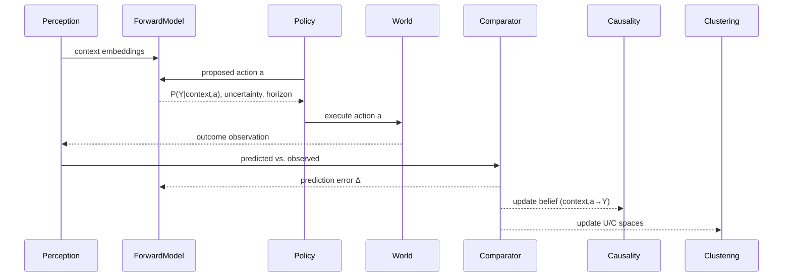
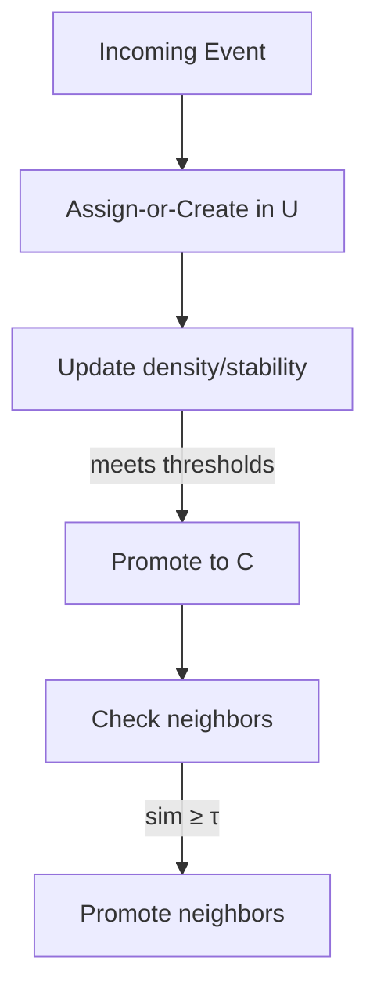

# Aethermind Learning Module — Agency, Symbols, and Expectation Architecture

> Goal: Give the agent a grounded sense of **agency**, learn **expectations** (predict outcomes of its own actions), and induce **symbols** that self-organize from an uncategorized latent pool into a categorized concept space — with neighbors “dragged” across the boundary once confidence is high enough.

---

## 0) TL;DR: The Learning Core Loop

1. **Ingest event** (multimodal: vision/audio/text/action + annotations + embeddings).
2. **Estimate agency**: compute `self_action_score ∈ [0,1]` and tie to motor/decision trace.
3. **Predict outcome** before acting (forward model): `P(Y | context, action)`.
4. **Act & observe** → compute **prediction error** Δ between predicted and observed.
5. **Update causal belief** linking `(context, action) → outcome` using temporal credit + counterfactuals.
6. **Symbol induction**: place event in **Uncategorized Space**, update local clusters; promote stable clusters to **Categorized Space** once confidence crosses threshold.
7. **Neighbor-drag**: when a cluster is promoted, pull near-lying neighbors across the boundary via hysteresis.
8. **Intrinsic goals**: choose next actions that maximize **information gain**: reduce uncertainty about borderline symbols and causal links.

---

## 1) Conceptual Model

### 1.1 Two-Space Symbol Topology

* **Uncategorized Space (U)**: a streaming pool of event embeddings and provisional symbols; fluid, noisy, exploratory.
* **Categorized Space (C)**: stable symbols with IDs (handles) and canonical prototypes.
* **Boundary Dynamics**:

  * *Promotion*: U → C when stability, density, and multimodal coherence exceed thresholds.
  * *Neighbor Drag*: promotion of one symbol may lift near neighbors (by similarity and shared evidence) across the boundary, with hysteresis to avoid churn.

### 1.2 What Counts as “Similar”?

* **Multimodal similarity**: weighted combo across vision, audio, text/speech, action/affordances, and pretrained tags.
* **Agency-coherence**: events caused by the agent vs. observed-only can weight similarity differently.
* **Contextual similarity**: time, location/scene, task state.

---

## 2) Data Structures (canonical JSON-like schemas)

### 2.1 Event Record

```json
{
  "start": 1754093547.0,
  "end": 1754093549.0,
  "session_id": "session_20250805_162657",
  "event_uid": "session_20250805_162657|chunk_0000.mp4|1754093547.000-1754093549.000",
  "event_id": "1150da069983657c4e028ac3",
  "source": "perception",
  "video_path": "chunks/session_20250805_162657/chunk_0000.mp4",
  "audio_path": "chunks/session_20250805_162657/chunk_0000.wav",
  "text_view": "tags: vendor, cave, merchant, stall, crate ; mood: tense ; is_music: True ; scene: catacomb ; audio: Whale vocalization, Glass, Music ; speech: Thank you.",

  "is_event": false,
  "event_score": 0.20333578585222647,
  "raw_motion": 3.14399308825068,
  "raw_energy": 17.74926254416442,

  "actions": [
    {
      "ts": 1754093547.7141027,
      "keys": [],
      "mouse": {
        "position": [0, 0],
        "buttons": {"left": false, "right": false, "middle": false},
        "scroll": [0, 0]
      }
    },
    {
      "ts": 1754093548.2152052,
      "keys": [],
      "mouse": {
        "position": [960, 540],
        "buttons": {"left": false, "right": false, "middle": false},
        "scroll": [0, 0]
      }
    }
  ],

  "annotations": {
    "vision_tags": [
      {"label": "vendor", "score": 0.2467},
      {"label": "cave", "score": 0.2385},
      {"label": "merchant", "score": 0.2382},
      {"label": "stall", "score": 0.2317},
      {"label": "crate", "score": 0.2264}
    ],
    "audio_moods": {
      "mood": "tense",
      "loudness": 0.06149059534072876,
      "is_music": true,
      "confidence": 0.8447445631027222,
      "top_labels": [
        {"label": "131,/m/032n05,Whale vocalization", "score": 0.8447445631027222},
        {"label": "435,/m/039jq,Glass", "score": 0.024271298199892044},
        {"label": "132,/m/04rlf,Music", "score": 0.021368462592363358}
      ]
    },
    "motion_analysis": {
      "movement_type": "unknown",
      "motion_intensity": 0.0,
      "directional_bias": "none"
    },
    "time_of_day": "unknown",
    "speech_transcript": "Thank you.",
    "scene_type": "catacomb",
    "vector_summary": {
      "mean": [10.8588705633, 19.1070362252, 31.3088938802, 0.0000808077, 0.0680292019, 0.0, 0.0, 0.0, 0.0],
      "std": [0.1880694373, 0.3222099998, 0.3768419686, 0.0005725946, 0.0091419269, 0.0, 0.0, 0.0, 0.0],
      "max": [11.1383834877, 19.6439243827, 31.8916064493, 0.0008672930, 0.0780474689, 0.0, 0.0, 0.0, 0.0],
      "min": [10.6084856610, 18.7991266718, 30.9699290445, -0.0005684920, 0.0560190704, 0.0, 0.0, 0.0, 0.0]
    },
    "vector_spikes": [0]
  },

  "vectors": [
    {"t": 1754079147.25, "x": [11.1383834877, 19.6439243827, 31.8916064493, 0.0008672930, 0.0560190704, 0.0, 0.0, 0.0, 0.0]},
    {"t": 1754079147.75, "x": [10.6084856610, 18.7991266718, 30.9822251157, -0.0003496546, 0.0756473171, 0.0, 0.0, 0.0, 0.0]},
    {"t": 1754079148.25, "x": [10.8551729681, 19.0473390239, 31.3918149113, 0.0003740846, 0.0780474689, 0.0, 0.0, 0.0, 0.0]},
    {"t": 1754079148.75, "x": [10.8334401363, 18.9377548225, 30.9699290445, -0.0005684920, 0.0624029510, 0.0, 0.0, 0.0, 0.0]}
  ],

  "embeddings": {
    "T": [/* ... existing 128d text embedding ... */],
    "S": [/* ... structured state embedding ... */],
    "F": [/* ... high-freq feature embedding ... */]
  },

  // → New/augmented fields for learning loop
  "agency": {
    "self_action_score": 0.0,
    "motor_function": null,
    "decision_trace_id": null
  },
  "expectation": {
    "predicted_outcomes": [],
    "pred_embedding": [],
    "pred_time_horizon_ms": 500
  },
  "observation": {
    "actual_outcomes": [],
    "obs_embedding": []
  },
  "prediction_error": {
    "distributional": null,
    "embedding_delta_l2": null,
    "calibration": {"brier": null}
  },
  "causality": {
    "links": []
  },

  // Backward-compatible valence; use label + numeric channels
  "valence": {"label": "unknown", "moral": 0.0, "risk": 0.0, "reward_proxy": 0.0}
}
```

### 2.2 Symbol Record

```json
{
  "symbol_id": "SYM_9fA7",
  "status": "uncategorized|candidate|categorized",
  "prototype": {
    "vision": [..], "audio": [..], "text": [..], "action": [..]
  },
  "support_events": ["event_id1", "event_id2", ...],
  "confidence": 0.74,
  "stability": {"age_events": 128, "days": 3, "drift": 0.06},
  "neighbors": [{"symbol_id":"SYM_xx","sim":0.81}],
  "tags": ["apple", "red", "edible"],
  "agency_profile": {"typical_self_action": 0.28},
  "moral_profile": {"harm": 0.0, "benefit": 0.2}
}
```

### 2.3 Symbol Graph (Knowledge Graph)

* Nodes: symbols
* Edge types: `SIMILAR_TO`, `CAUSES`, `CO_OCCURS`, `FOLLOWS`, `AFFORDS(action)`
* Weights: confidence, recency, stability

---

## 3) Pipelines

### 3.1 Perception → Interpretation

* Annotators (CLIP/YOLO/YAMNet/Whisper/etc.) produce multimodal features.
* Event builder enriches with `self_action_score` using actuator logs + decision traces.

### 3.2 Expectation Generator (Forward Model)

* Learns `P(Y | context, action)` (discrete outcomes and/or embedding prediction).
* Produces **predicted outcomes** + uncertainty + time horizon.

### 3.3 Outcome Comparator

* Compares predicted vs. observed; computes **prediction error** metrics.
* Updates calibration (Brier/ACE) and stores deltas in memory for learning.

### 3.4 Symbol Induction (Online)

* Maintains an approximate NN index (e.g., HNSW) over U and C.
* **Assign-or-Create**: incoming event → nearest cluster; if too far, seed a new provisional symbol.
* **Update**: online centroid, covariance, density.
* **Promotion**: if density + stability + multimodal coherence exceed thresholds, move to C.
* **Neighbor Drag**: pull symbols whose sim ≥ τ\_drag and whose uncertainty ≤ τ\_uncert.

### 3.5 Agency Attribution & Causality

* Temporal window buffer T seconds around actions.
* Score causal links using: temporal priority, consistency, intervention evidence (self\_action), and counterfactual rollouts via the forward model.
* Maintain a **causal belief table** per (context, action → outcome).

### 3.6 Intrinsic Motivation / Active Learning

* Reward = Expected Information Gain (EIG) about:

  * (a) promotion boundaries for symbols,
  * (b) uncertain causal links,
  * (c) moral risk/benefit where present.
* Planner picks experiments (actions) to maximize EIG under risk constraints.

---

## 4) Algorithms (Sketches)

### 4.1 Online Multimodal Similarity

Let modality weights w\_m be reliability-adaptive (e.g., learned via meta-gradient from prediction error history):

```
sim(x, y) = Σ_m w_m · cos(emb_m(x), emb_m(y))
subject to Σ_m w_m = 1, w_m ≥ 0
```

### 4.2 Promotion Criteria

```
if density ≥ τ_density
  and stability.age_events ≥ τ_age
  and drift ≤ τ_drift
  and coherence_multimodal ≥ τ_coh
  then promote(U_symbol → C_symbol)
```

### 4.3 Neighbor Drag (with Hysteresis)

```
for n in neighbors(promoted_symbol):
  if sim(n, promoted_symbol) ≥ τ_drag_high or
     (n.status==candidate and sim ≥ τ_drag_low and n.uncert ≤ τ_uncert):
        promote(n)
```

### 4.4 Causal Belief Update

Maintain Dirichlet/Beta counts for discrete outcomes; update with observed evidence and counterfactuals:

```
for outcome k:
  α_k ← α_k + w_real·1[observed==k] + w_cf·P_cf(k)
normalize α to get posterior P_k
```

* `w_real > w_cf` prioritizes real interventions; counterfactuals smooth sparsity.

### 4.5 Intrinsic Reward: Boundary Uncertainty Reduction

```
r_info ≈ H_before(boundary) − E_action[ H_after(boundary) ]
```

Choose actions that maximally reduce entropy of promotion decisions or causal tables.

---

## 5) Moral Reasoning Hook

* Add **moral valence channels** (harm/benefit detectors, social norm signals) into event + symbol profiles.
* Track **responsibility** via agency-weighted links: harm with high `self_action_score` increases responsibility.
* Planning layer can optimize **utility constrained by moral risk**.

---

## 6) Module Interfaces

* **aethermind-perception** → captures synchronized raw inputs; produces **EventSeed** records (IDs, timing, raw paths, lightweight dyn features) and publishes them to the bus.
* **aethermind-interpretation** → subscribes to EventSeed, runs annotators (vision/audio/speech/motion), computes T/S/F embeddings, and **upgrades EventSeed → EventRecord** (non-destructively). Also computes `self_action_score` using input semantics.
* **learning.forward\_model** → produces expectations & counterfactuals.
* **learning.clustering** → maintains U/C spaces + symbol graph.
* **learning.causality** → updates causal beliefs; exposes `predict_effect(context, action)`.
* **memory** → writes events, symbols, and graph with versioning.
* **reflection** → summarizes learned symbols/links; surfaces open questions.
* **planner** → selects experiments using intrinsic reward.

### 6.1 Perception ↔ Interpretation Contract (Proposed)

**EventSeed (perception output)**

```json
{
  "event_uid": "session_...|chunk_0000.mp4|1754093547.000-1754093549.000",
  "session_id": "session_20250805_162657",
  "start": 1754093547.0,
  "end": 1754093549.0,
  "source": "perception",
  "video_path": "chunks/.../chunk_0000.mp4",
  "audio_path": "chunks/.../chunk_0000.wav",
  "actions": [ { "ts": 1754093547.7141, "raw": {...}, "semantic": {"action": null, "valid_for_game": false} } ],
  "sync": { "av_ms": 2.1, "ai_ms": -3.4, "vi_ms": 1.0, "beacon_id": 42 },
  "video_dyn": { "flow_mean": 0.013, "flow_std": 0.004, "cut_prob": 0.02 },
  "audio_dyn": { "rms_frames": [0.011, 0.013, ...], "sr": 16000 },
  "system": { "fps": 60, "dropped_frames": 0, "window_focused": true },
  "decision_trace": { "id": null, "policy_hash": null },
  "valence": { "label": "unknown", "moral": 0.0, "risk": 0.0, "reward_proxy": 0.0 }
}
```

**EventRecord (interpretation output)**

* Exactly your rich schema from §2.1, plus computed fields:

  * `annotations.*` (vision\_tags, audio\_moods, scene\_type, speech\_transcript, motion\_analysis, vector\_summary, vector\_spikes)
  * `embeddings.T/S/F`
  * `agency.self_action_score`, `motor_function`, `decision_trace_id`
  * optional `expectation`, `observation`, `prediction_error`, `causality` when available.

**Idempotency rule**: Interpretation **must not** overwrite Perception’s raw fields; it only appends or fills `null` targets. If re-run, it should detect an existing `event_id` and write a **new version** `event_id_v2` with a pointer `prev_event_id`.

### 6.2 Transport & Storage

* **Message bus (recommended)**: `events.seed` → `events.enriched` topics.
* **Dedup key**: `event_uid`.
* **Backpressure**: interpretation workers ack with `processing_ms`; Perception throttles when queue depth > N.
* **Memory layout**:

  * `/sessions/{session_id}/raw/{video,audio}/...`
  * `/sessions/{session_id}/events/{event_id}.json` (EventRecord)
  * `/sessions/{session_id}/events/{event_id}/embeddings/{T,S,F}.npy`

### 6.3 Validation & Versioning

* JSONSchema for EventSeed and EventRecord with semantic checks (e.g., `0 ≤ self_action_score ≤ 1`).
* Add `schema_version`: `{major: 1, minor: 0}` to both.
* Write **change logs** to `events/{event_id}/audit.json` capturing annotator versions and hashes.

### 6.4 Failure Modes & Recovery

* If annotator fails: emit `events.error` with `{event_uid, annotator, error, retryable}`; keep EventSeed intact.
* Partial success allowed: attach `annotations.partial=true` and a list of completed annotators.
* Reprocessing job can resubscribe to past EventSeeds using a time/window filter.

### 6.5 Metrics (Perception responsibility)

* `capture.fps`, `capture.dropped_frames`, `sync.lag_ms{av,ai,vi}` (p50/p95),
* `inputs.valid_for_game_ratio`, `inputs.semantic_coverage` (mapped vs raw),
* `events.throughput` (seed/sec), `bus.backlog`.

## 7) Sequence Diagrams

### 7.1 Action–Expectation–Outcome



### 7.2 Promotion & Neighbor Drag



---

## 8) Minimal Viable Implementation Plan (Phased)

**Phase 0 — Logging & Schema (1–2 days)**

* Emit Event Records with `self_action_score`, predicted vs. observed fields.

**Phase 1 — Forward Model v0 (3–5 days)**

* Train a simple context→outcome predictor (discrete outcomes + embedding regression) on buffered episodes.
* Track calibration (Brier score) and Δ metrics.

**Phase 2 — Online Clustering v0 (5–7 days)**

* HNSW index for fast kNN; streaming assign-or-create; density & stability tracking.
* Simple promotion rule; manual τ tuning.

**Phase 3 — Causality v0 (5–7 days)**

* Temporal windowed linking; Beta/Dirichlet counters; counterfactual from forward model.

**Phase 4 — Intrinsic Motivation v0 (5 days)**

* Entropy reduction-based exploration focused on boundary symbols and uncertain links.

**Phase 5 — Neighbor Drag + Hysteresis (3–4 days)**

* Implement τ\_high/τ\_low; avoid thrash.

**Phase 6 — Moral Hook (optional v0, 3–5 days)**

* Add harm/benefit detectors; responsibility weighting.

Deliverables per phase: unit tests, metrics dashboard, example traces.

---

## 9) Metrics & Experiments

* **Expectation quality**: Brier score, NLL, calibration curves; embedding Δ.
* **Agency attribution**: accuracy vs. ground truth actuator logs; AUC.
* **Symbol quality**: cluster purity/ARI vs. oracle tags; promotion stability; drift.
* **Causality**: precision/recall of (action→effect) links; intervention success rate.
* **Learning efficiency**: info gain per action; regret vs. oracle policy.

Synthetic tests: gridworld with controllable physics + scripted confounders; then Eastshade scenarios.

---

## 10) Pseudocode (Core Update)

```python
# on_event(context, optional_action)
emb = encode_multimodal(context)
if action is not None:
    pred = forward_model.predict(context, action)
    outcome = execute_and_observe(action)
    err = comparator(pred, outcome)
    causality.update(context, action, outcome, err)
else:
    outcome = observe()

symbol = clustering.assign_or_create(emb)
clustering.update_stats(symbol, emb, outcome)
if clustering.meets_promotion_criteria(symbol):
    clustering.promote(symbol)
    clustering.neighbor_drag(symbol)

intrinsic_reward = info_gain.estimate(boundary_uncertainty, causal_uncertainty)
action_next = planner.choose_action(intrinsic_reward, risk)
```

---

## 11) Open Questions for You

1. **Time Horizons**: what prediction windows (e.g., 200ms, 800ms, 2s) matter in Eastshade?
2. **Outcome Alphabet**: do we start with a small discrete set (doors open, items move) + an embedding head, or go embedding-only first?
3. **Budget**: do you want a pure online learner (no big offline batches) or are micro-batches OK?
4. **Risk constraints**: any actions we must avoid during exploration?
5. **Telemetry**: do you want a live dashboard for boundaries (U↔C) and causal tables?

---

## 12) Implementation Notes

* Start with simple cosine similarities + fixed weights; make weights learnable later.
* Keep symbol IDs **opaque** (e.g., `SYM_XXXX`) to avoid human meaning leakage.
* Version memory writes; store promotion/demotion events with timestamps to audit history.
* Use **hysteresis** on *all* thresholds that affect category transitions to prevent oscillation.
* Log **counterfactuals** distinctly from real interventions.

---
